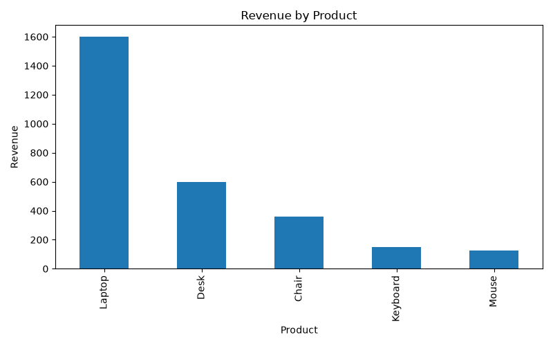
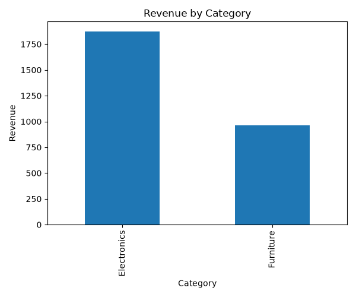
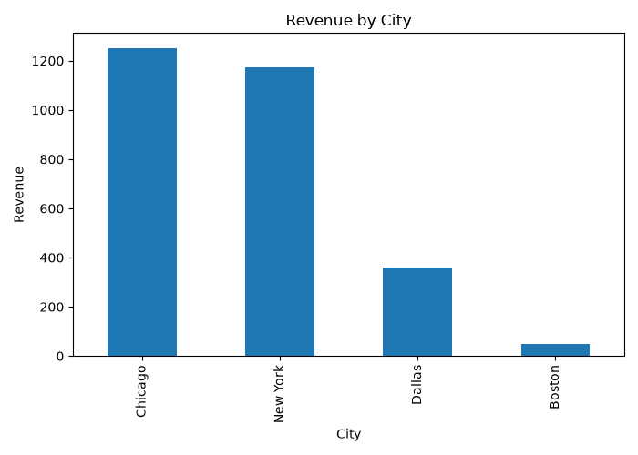

# Sales Data Analysis Using Python

## Project Overview
This is a beginner data analysis project using Python and pandas.

The goal of this project is to analyze sales data and find useful business insights such as total revenue, best product, best category, best city, and top customer.

## Dataset
The dataset contains 10 sales records.

Columns used in the dataset:

- OrderID
- Date
- Product
- Category
- Quantity
- Price
- Customer
- City

## Tools Used
- Python
- pandas
- matplotlib
- PyCharm
- GitHub

## Project Structure

```text
phyton/
├── data/
│   └── sales_data.csv
├── src/
│   └── sales_analysis.py
├── visuals/
│   ├── revenue_by_product.png
│   ├── revenue_by_category.png
│   └── revenue_by_city.png
├── report/
│   └── summary.md
└── README.md
```

## Visuals

### Revenue by Product



### Revenue by Category



### Revenue by City



## Sample Output

The final console output is saved here:

```text
output/analysis_output.txt


Important: if you paste this, make sure the code block is closed with:

````markdown


**Step 4: Upload New Files To GitHub**

Upload/update these files:

```text
README.md
output/analysis_output.txt
```

If you also changed code, upload:

```text
src/sales_analysis.py
```

**Now Your Project Includes**

- Dataset
- Python code
- Charts
- Summary report
- Sample output
- README
- Requirements file

After this, the project is complete enough for a beginner portfolio.
